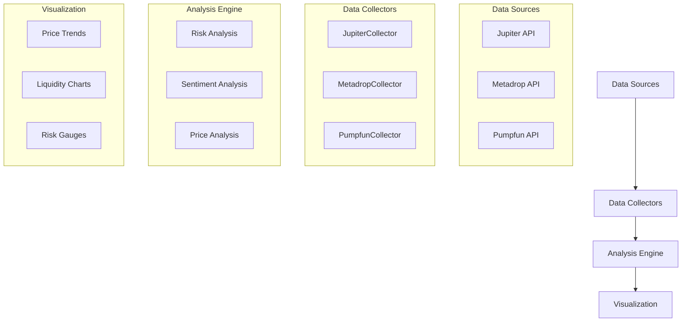

# PeepSeek

<div align="center">
  
</div>

A sophisticated Solana memecoin analysis agent powered by DeepSeek's foundational logic. PeepSeek aggregates data from multiple sources to provide comprehensive insights into memecoin performance, risks, and market sentiment.

## Features

### Multi-Source Data Collection
- **Jupiter**: Real-time price and liquidity data
- **Metadrop**: Token information and market metrics
- **Pumpfun**: Social signals and community engagement

### Advanced Analysis
- Risk scoring based on multiple factors
- Market sentiment analysis
- Price trend comparison
- Liquidity distribution analysis

### Visualization
- Interactive price charts
- Liquidity comparison graphs
- Risk assessment gauges
- Market sentiment indicators

## Architecture



## Installation

```bash
# Clone the repository
git clone https://github.com/sanfactor/0130.git
cd peepseek
poetry install
```

## Usage

```python
from peepseek.analysis import MemecoinAnalyzer
from peepseek.data_collectors import JupiterCollector, MetadropCollector, PumpfunCollector

# Initialize collectors
jupiter = JupiterCollector()
metadrop = MetadropCollector()
pumpfun = PumpfunCollector()

# Create analyzer
analyzer = MemecoinAnalyzer(
    jupiter_collector=jupiter,
    metadrop_collector=metadrop,
    pumpfun_collector=pumpfun
)

# Analyze token
token_address = "YOUR_TOKEN_ADDRESS"
analysis, visualizations = await analyzer.analyze_token(token_address)

# Access analysis results
print(f"Risk Score: {analysis['risk_score']}")
print(f"Market Sentiment: {analysis['market_sentiment']}")
print("Recommendations:", analysis['recommendations'])
```

## Development

```bash
# Run tests
poetry run pytest

# Format code
poetry run black .
poetry run isort .
```

## License

MIT License

## Contributing

1. Fork the repository
2. Create your feature branch
3. Commit your changes
4. Push to the branch
5. Create a Pull Request
